# Transforming cell complexes via SMT

Daniel Shapero

2021 November 5

----


---

# Why am I here

----

### My day job

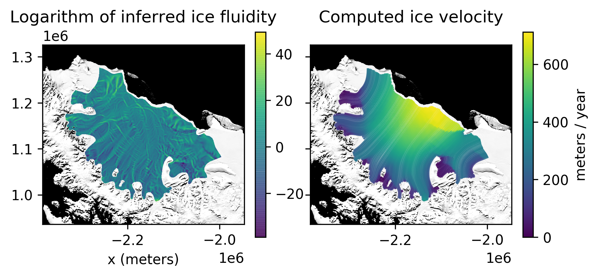

----

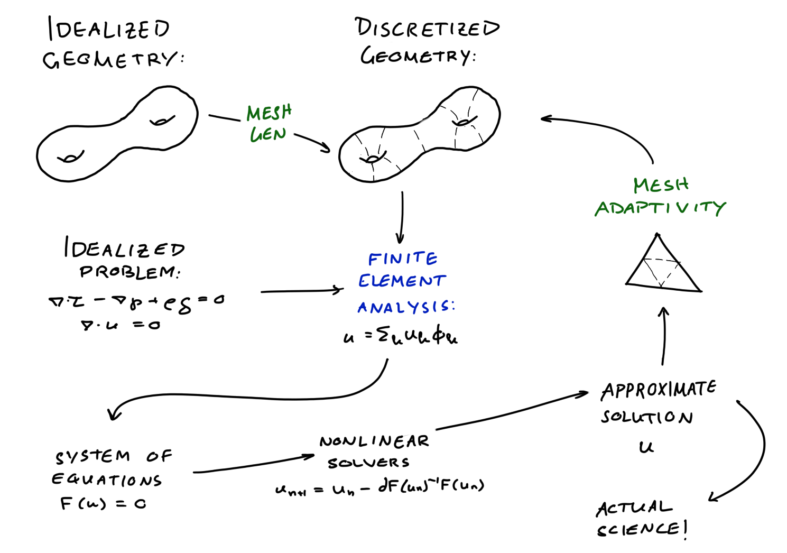

----

### Everyone's least favorite task

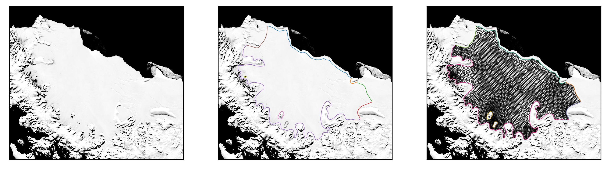

----

### Everyone's least favorite task

1. Digitize glacier outline manually in a GIS
2. Transform the outline file into the mesh generator's input format
3. Run the mesh generator
4. Run your simulation
5. Realize your data is goofed up, go to 1.
6. Realize your resolution is poor, go to 3.

----

### Meshing

* Meshing is a huge bottleneck.
* The quality of the mesh affects how well finite element approximations work.
  - Small angles $\Rightarrow$ bad condition number
  - Large angles $\Rightarrow$ bad interpolation error
* All simulation workflows should be adaptive.


---

# Delaunay triangulation

----

### Delaunay triangulation

* The **circumsphere** of a simplex is the unique sphere passing through all its points.
* A **Delaunay triangulation** has the property that **the circumsphere of every simplex is empty**.

----

### Empty circumcircles

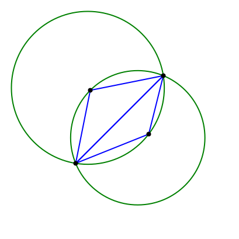 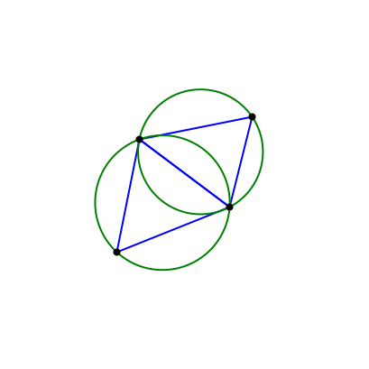

Triangulation of two cells; left is not Delaunay, right is

----

### A key property

Among all triangulations of a 2D point set, Delaunay triangulations **maximize** the **minimum** angle.

----

### Algorithms

There are two basic types of algorithms in 2D:
* Lawson's algorithm: edge flipping
* Bowyser-Watson algorithm: polygon retriangulation

----

### Bowyer-Watson algorithm

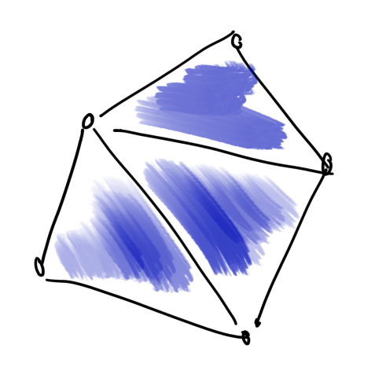

----

### Bowyer-Watson algorithm


----

### Bowyer-Watson algorithm

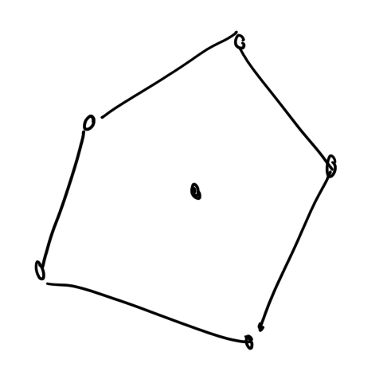

----

### Bowyer-Watson algorithm

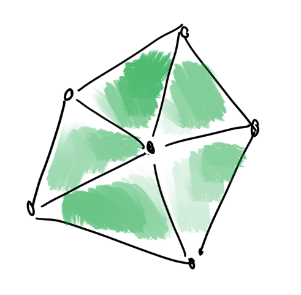

----

### Aren't we done?

* We started with just $\partial\Omega$.
We also need to:
  1. Fill points in the interior
  2. Constrain the triangulation to include $\partial\Omega$
* Filling interior points is half the challenge -- Delaunay is best, still might not be good enough.

----


<small>From <a href="https://people.eecs.berkeley.edu/~jrs/papers/delref3d.pdf">Shewchuk (1998)</a>:
"Tetrahedra with poor angles.
Needles and wedges have edges of greatly disparate length; caps have a large solid angle; slivers have neither, but can have good circumradius-to-shortest edge ratios."
</small>


----

### Things people work on

* Better incremental interior insertion
* Evaluating geometric kernels in floating point
* Fixing sub-optimality of Delaunay in 3D
* Quad and hex meshing
* Meshing curved geometries
* Correcting broken or degenerate topologies

----

### Before we get ahead of ourselves


* Let's look at some code for transforming the topology of a triangulation:
    * [TTL](https://github.com/SINTEF-Geometry/TTL/blob/49ff0dbabefccb55b1f5793dab2ffcda1cb4da7d/src/halfedge/HeTriang.cpp#L542)
    * [CGAL](https://github.com/CGAL/cgal/blob/ed3503d2381842f837a8118a749ab380f889485b/Triangulation_2/include/CGAL/Regular_triangulation_2.h#L1629)
    * [gmsh](https://gitlab.onelab.info/gmsh/gmsh/-/blob/master/Mesh/meshGFaceDelaunayInsertion.cpp#L1901)
    * [TriWild](https://github.com/wildmeshing/TriWild/blob/d85ec7a6faf50138c034a174226515b44d345c03/src/triwild/edge_swapping.cpp#L54)
    * [garbage](https://gitlab.com/danshapero/zmsh2/-/blob/delaunay/src/algorithms/delaunay.c#L52) by me
* How does this code make you feel?

----

Flipping an edge is surprisingly hard.


3D transformations are harder: 3 $\leftrightarrow$ 2 face flips...

<small>From <a href="https://en.wikipedia.org/wiki/Flip_graph">flip graph</a> wiki page</small>

----

...but those are far from the worst of it!


<small>From <a href="https://doi.org/10.1007/978-3-540-75103-8_1">Klingner and Shewchuk (2008)</a></small>

----

**Topological transformation kernels are heinous.**

Can we make them nicer to look at and write?

----

### Desiderata

* Lots of literature focuses only on simplices in 2D or 3D.
I want cubical or polyhedral complexes!
* Ordering only gives orientation for simplices.
No more half-edge or winged edge data structures.
* **Less imperative, more declarative.**


---

# Ordering and orientation

----

### Let's talk about triangles


A triangle $\{x_0, x_1, x_2\}$ in 2D is +-ordered if

$$\det\left[\begin{matrix} x_0 & x_1 & x_2\end{matrix}\right] > 0$$

<small>*using homogeneous coordinates</small>

----


* +-ordered adjacent triangles traverse their shared edge in the opposite order.
* The edge has no real ordering of its own.

----

 

* +-ordering of tetrahedra is also defined by the determinant of the corners.
* Let's think about their shared triangle + edges...

----

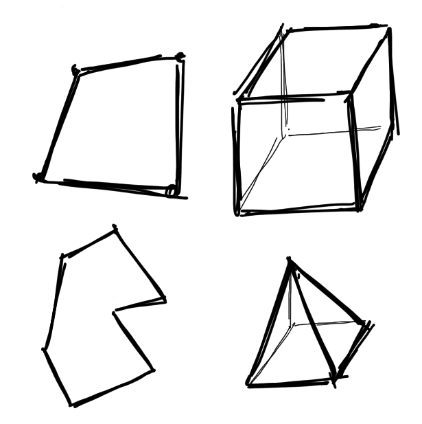

What about quads and hexes?
Or non-convex polygons?
Or pyramids?

----

 

There are non-Hamiltonian polyhedra.
How do you order the vertices?

<small>From wikipedia, [Herschel graph](https://en.wikipedia.org/wiki/Herschel_graph).
See also the [Tutte](https://en.wikipedia.org/wiki/Tutte_graph) and [Goldner-Harary](https://en.wikipedia.org/wiki/Goldner%E2%80%93Harary_graph) graphs.</small>

----

 

What would happen if our tetrahedron lived in 4D?
Or a 4D polytope got projected into 3D?

<small>From wikipedia, [5-cell](https://en.wikipedia.org/wiki/5-cell) and [tesseract](https://en.wikipedia.org/wiki/Tesseract)</small>

----

* **The moral**: Vertex ordering generalizes poorly and assumes nice manifold inputs.
* **The problem**: Lots of mesh data structure in FEM packages rely on ordering.
* **The solution**: A data structure that encodes *topology* independent of *geometry*.


---

# Homological algebra

----

### Cell complexes

* [**Cell complexes**](https://en.wikipedia.org/wiki/CW_complex) are a generalization of triangulations and polygonizations.
* It's a bunch of shapes glued together*.
* But they can have e.g. hanging edges.

${}$

<small>*The fancy math definition is long-winded and equivalent to this.</small>

----

The following definitions are going to seem hella weird at first, just... mellow out it'll be ok.

----

### Chains

* The *$k$-skeleton* of a complex is the collection $\\{\sigma_1, \ldots \sigma_m\\}$ of all its $k$D cells.
* A [$k$-**chain**](https://en.wikipedia.org/wiki/Chain_(algebraic_topology)) is a formal $\mathbb{Z}$-linear combination
$$C = c_1\sigma_1 + \ldots + c_m\sigma_m$$
* We can identify a cell $\sigma_i$ with the chain
$$C_i = 0\cdot\sigma_1 + \ldots + 1\cdot\sigma_i + \ldots + 0\cdot\sigma_m$$

----

The 0-skeleton


----

The 0- and 1-skeletons


----

The 0-, 1-, and 2-skeletons


----

A 2-chain


----

### Boundaries

* The **boundary operator** is a linear mapping from $k$-chains to $k - 1$-chains:
$$\partial\_k : \mathscr C_k \to \mathscr C_{k - 1}$$
* $\partial_k$ encodes both **adjacency** and **orientation**.

----

$$\Huge{\partial_k\circ\partial_{k + 1} = 0}$$

----

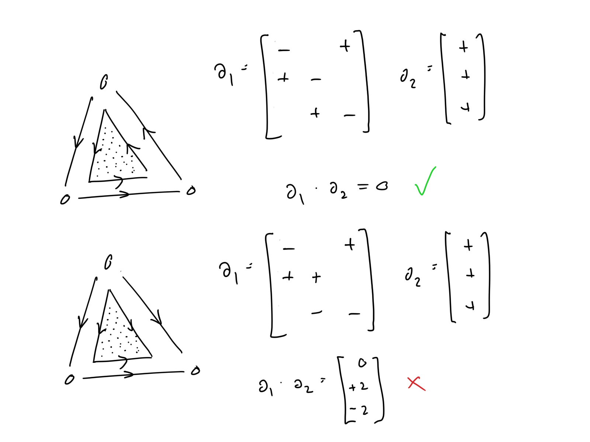

----

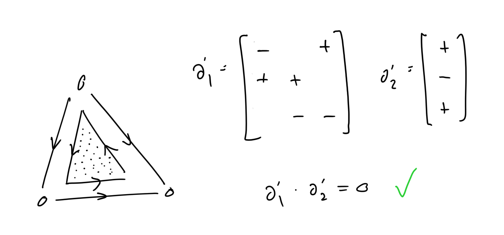

* Suppose that $\partial_1\cdot\partial_2 = 0$ and $PQ = \alpha I$.
* Then $\partial_1' = \partial_1\cdot P$ and $Q\cdot\partial_2'$ are still good!

----

Joining polygons is just chain addition!


----

### An annoying problem

* $\partial\circ\partial = 0$ is useful, but what prevents us from having an edge $e$ such that
$$\partial e = v_1 + v_0?$$
* We could impose this as an extra side condition.

----

### Some convenient fictions

* Or, we could say that there is a cell $\bot$ of dimension -1 such that, for all $k$,
$$\partial v_k = \bot$$
* The vertex boundary matrix is a row of 1s!
* If we did have $\partial e = v_1 + v_0$, then
$$\partial_0\circ\partial_1e = 2\bot \neq 0!$$

----


---

# Transforming topologies

----

### A data structure

* We can represent cell complexes as a bunch of **sparse matrices** with **integer entries**.
* Many software packages offer sparse matrices with generic entries: scipy, eigen, ...
* But storage formats aren't straightforward and you can easily go accidentally quadratic

----

Some pseudocode to check that a topology is good:

```python
for k in range(dimension):
    A = topology.boundary(k)
    B = topology.boundary(k + 1)
    C = A @ B
    if norm(C) != 0:
        return False

return True
```

----

### Transformations

* Goal: specify topological operations declaratively.
Conveniently, ops are always local to a few cells.
* Plan: use an SMT solver to find a valid set of transformations to the (local) boundary operators.

----

### General plan

* Extract the active cells for the operation.
* Make a numpy array of Z3 integer variables for each boundary operator.
* Add the constraint that $\partial\cdot\partial = 0$.
* Add op-specific constraints.
* Check for satisfiability.
* Scatter the local matrices to global.

----

code samples

----

demonstration


---

# Closing thoughts

----

This representation of cell complexes:
* Is easy to check for correctness
* Is independent of the intrinsic dimension and coordination number
* Allows a rich set of transformations to be implemented easily and declaratively
* Is definitely sub-optimal for space and time

----

### Parallelism

* All of this was very single-threaded.
* For real PDE problems, we decompose the domain and go parallel.
* We can treat the domains and the interfaces between them as a higher-level cell complex.

----

### Parallelism

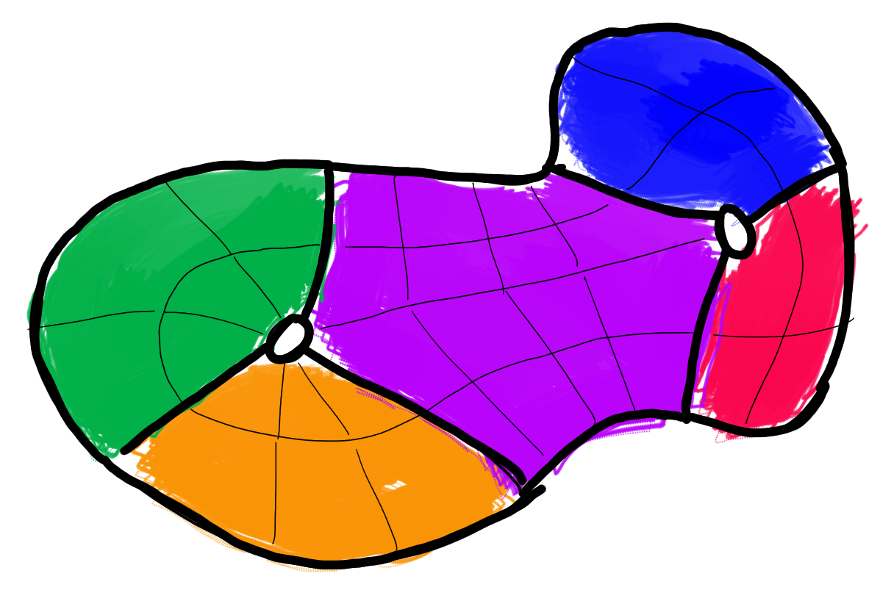

A domain, decomposed into subdomains.
Thick lines demarcate subdomain boundaries, thin lines the cell boundaries.
Together they form a *nested* cell complex.

----

### Further reading

* Popular mesh generators: [Triangle](https://www.cs.cmu.edu/~quake/triangle.html), [aCute](https://www.cise.ufl.edu/~ungor/aCute/), [tetgen](https://tetgen.org), [TriWild](https://github.com/wildmeshing/TriWild), [TetWild](https://github.com/wildmeshing/fTetWild), [gmsh](https://gmsh.info)
* [Leila De Floriani](http://users.umiacs.umd.edu/~deflo/) has written a lot about data structures for cell complexes [[1]](https://doi.org/10.1145/1057432.1057444)[[2]](https://doi.org/10.1007/978-3-642-15414-0_24)[[3]](https://dl.acm.org/doi/abs/10.5555/1281920.1281940)

----

help


----

### Help

* I told James W about this and he said "program synthesis"?
* I'm representing the variables as Ints and constraining to -1, 0, or +1.
Is there a better way?
* What can I do to make Z3 happy when we go to more unknowns? e.g. large multi-face ops
* Z3 has arrays but I [shouldn't use them](https://stackoverflow.com/questions/11068561/create-an-array-with-fixed-size-and-initialize-it)?
* Please tell me if all this sounds insane and stupid


---

# Epilogue

----

### Homology

* If $\alpha = \partial\sigma$ for some $\sigma$, then $\partial\alpha = 0$.
* Can we have $\partial\alpha = 0$ but $\forall\sigma, \alpha \neq \partial\sigma$?
* These chains constitute the **homology groups**:
$$H_k = \text{kernel }\partial_k / \text{image }\partial_{k + 1}$$

----


----


----


----


----

### Homology

* Morphisms of spaces imply morphisms of homology groups.
* And this is why there's category theory.


